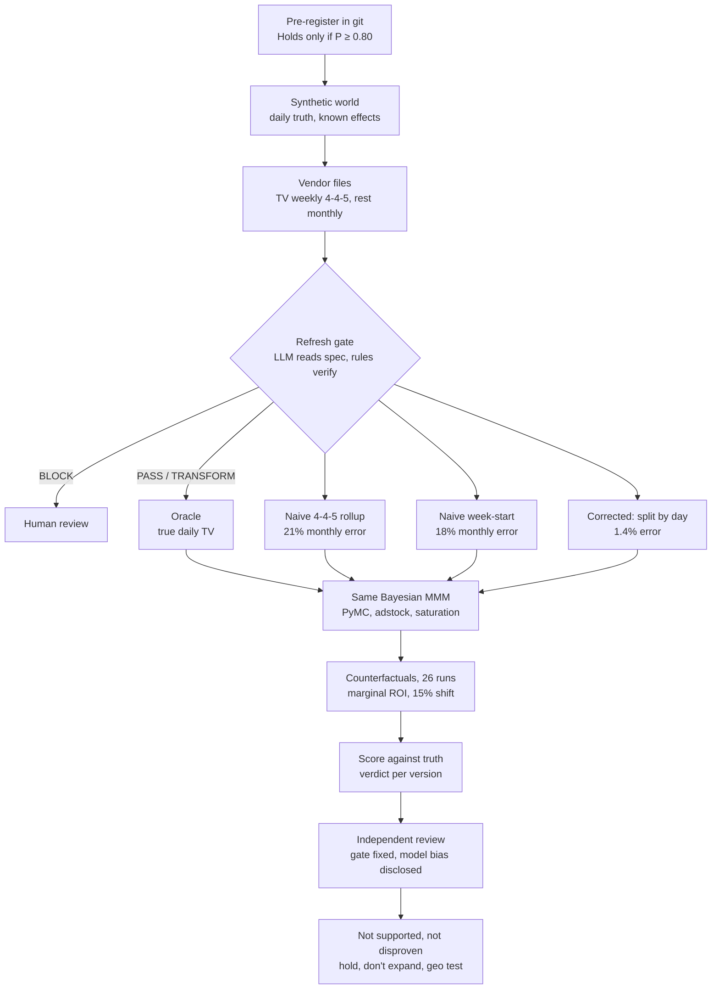
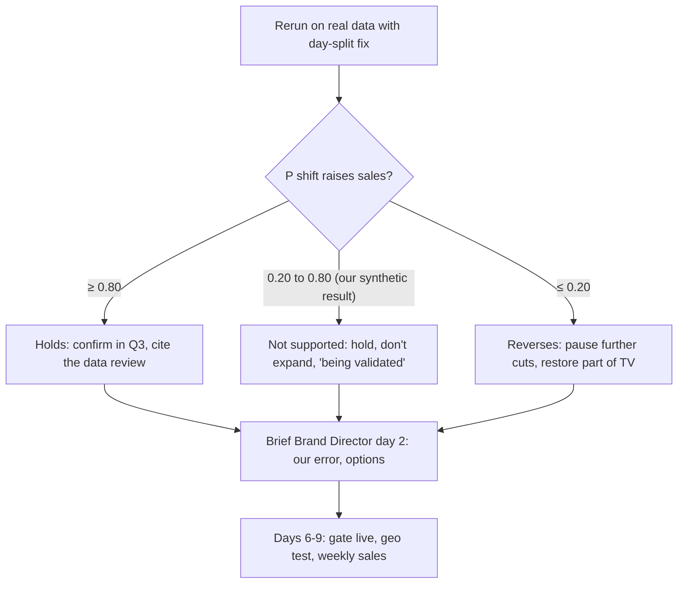
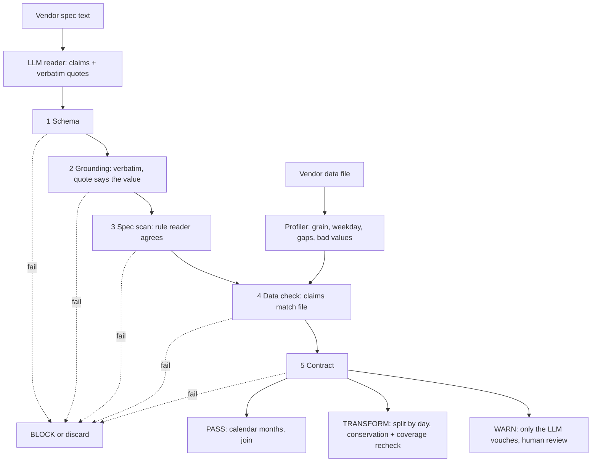

# Flowcharts (render on GitHub)

## 1. End-to-end flow

```mermaid
flowchart TD
  A[Pre-register in git<br/>Holds only if P ≥ 0.80] --> B[Synthetic world<br/>daily truth, known effects]
  B --> C[Vendor files<br/>TV weekly 4-4-5, rest monthly]
  C --> G{Refresh gate<br/>LLM reads spec, rules verify}
  G -- BLOCK --> H[Human review]
  G -- PASS / TRANSFORM --> O[Oracle<br/>true daily TV]
  G --> N1[Naive 4-4-5 rollup<br/>21% monthly error]
  G --> N2[Naive week-start<br/>18% monthly error]
  G --> F[Corrected: split by day<br/>1.4% error]
  O & N1 & N2 & F --> M[Same Bayesian MMM<br/>PyMC, adstock, saturation]
  M --> CF[Counterfactuals, 26 runs<br/>marginal ROI, 15% shift]
  CF --> S[Score against truth<br/>verdict per version]
  S --> R[Independent review<br/>gate fixed, model bias disclosed]
  R --> V[Not supported, not disproven<br/>hold, don't expand, geo test]
```

## 2. Client decision after the real-data rerun

```mermaid
flowchart TD
  A[Rerun on real data with day-split fix] --> B{P shift raises sales?}
  B -- "≥ 0.80" --> H[Holds: confirm in Q3, cite the data review]
  B -- "0.20 to 0.80 (our synthetic result)" --> N[Not supported: hold, don't expand, 'being validated']
  B -- "≤ 0.20" --> R[Reverses: pause further cuts, restore part of TV]
  H & N & R --> D[Brief Brand Director day 2: our error, options]
  D --> E[Days 6-9: gate live, geo test, weekly sales]
```

## 3. Refresh gate

```mermaid
flowchart TD
  DF[Vendor data file] --> P[Profiler: grain, weekday, gaps, bad values]
  SP[Vendor spec text] --> L[LLM reader: claims + verbatim quotes]
  L --> R1[1 Schema] --> R2[2 Grounding: verbatim, quote says the value] --> R3[3 Spec scan: rule reader agrees] --> R4[4 Data check: claims match file] --> R5[5 Contract]
  P --> R4
  R1 & R2 & R3 & R4 & R5 -. fail .-> X[BLOCK or discard]
  R5 --> PASS[PASS: calendar months, join]
  R5 --> T[TRANSFORM: split by day, conservation + coverage recheck]
  R5 --> W[WARN: only the LLM vouches, human review]
```
